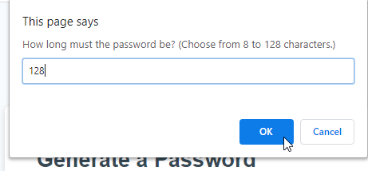
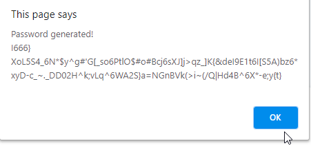

Welcome to my Password Generator App.

You can find the application here: https://ong-osmond.github.io/Osmond-s-Password-Generator/

Features:

1. Generate a password from 8 to 128 characters in length. The app validates the required password length is valid.

2. Select from the following chacter types to include in the password: lower case characters, upper case characters, numbers and/or special characters. At least one character type must be selected.

3. Based on the required password length and the required character types, a password will automatically be generated. This password will be displayed on an alert then written on the password field.

4. Generate a password as many times as desired.
